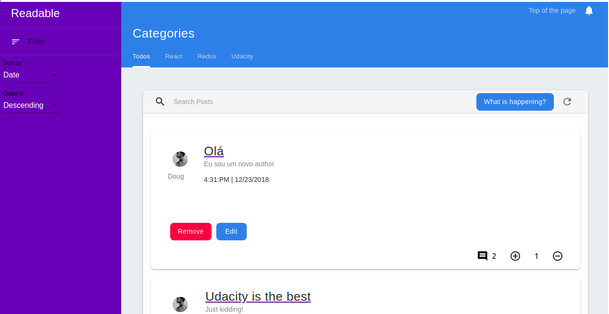

# **Readable**
**Project Readable** is the second project from the **Udacity's React Developer Nanodegree** program. We should build a web application for content and comments like a Blog. The app will allow users to post content in predefined categories, comment on their own posts and comment on other posts. Besides that, they can vote for comments and posts, this way they can show in a quantitative way how much they suports others' people content. Users can edit and delete posts and comments. The project emphasizes the use of **REDUX** to manage the application state.

## **Table of contents**
- [**Readable**](#readable)
  - [**Table of contents**](#table-of-contents)
  - [**How to install**](#how-to-install-using-ubuntu)
  - [**How to run**](#how-to-run)
    - [**API Server**](#start-the-api-Server)
    - [**Start the Client**](#start-the-client)
  - [**How it works**](#how-it-works)
    - [**Main Page**](#main-page)
    - [**Dashboard**](#dashboard)
    - [**Details Page**](#details-page)
  - [**Features**](#features)
  - [**Built with**](#built-with)
  - [**Contributing**](#contributing)
  - [**Authors**](#authors)
  - [**License**](#license)
  - [**Contact me**](#contact-me)
 

## **How to install using Ubuntu**
To clone and run this application, you'll need [Git](https://git-scm.com/) and [Node.js](https://nodejs.org/en/download/) (which comes with [npm](http://npmjs.com/)) installed on your computer. After have them installed, from your terminal run:

```bash
# Clone this repository
$ git clone https://github.com/dwolopes/readable-post-react-redux

# Go into the repository and install the application dependencies
$ cd reactnd-readable
$ npm install

# Go to api-server folder and install api-server dependencies
$ cd api-server
$ npm install
```

> [Dowload Node.Js and NPM](https://nodejs.org/en/download/).

[(Back to top)](#readable)

## **How to run**
After install all dependencies, follow the steps bellow to run the application(App) in  **Development mode**:

### **Start the API Server**

* In the root of the folder, follow the commands bellow:

```bash
# Clone this repository
$ cd readable-post-react-redux/api-server

# Start the API Server
$ node server
```

### **Start the Client**

* In this mode, hot loader is configured to be triggered on files changes.

```bash
# Clone this repository
$ cd readable-post-react-redux/frontend

# Start the client
$ npm start
```

## **How it works**

### **Main Page**
This page is the root page. At this page the user can see all the posts created or choose to see them by category in the blue **Navbar**, using the options presented. Aside the dashboard, the user have a  **purple** filter toolbar which allows sort the posts by date, comments, score, and number of comments.

### **Dashboard**
At the main page, a Dashboard shows all the posts using cards and each one of them (posts) has some information and features:
- Title: clicking on it the user is redirected to the post details page;
- body: shows the main content of the post;
- Hour and Date which the post was made;
- Add Post button which opens a Modal Window do add a new Post.
- Remove and Edit button;
- Score system;
- Comments count;

### **Details Page**
At the details page the user will see the same post card with the same features and informations from main page but with full description being shown. Also, at this page the user can comment to the post and reply to the comments. Similiar to the Post card, comments are presented using cards and users can remove, edit and add comments as well. Comments can be voted by readers.

[(Back to top)](#readable)

## **Features**
As the project has a lot of potencial to grow in features, I decided to add some new features beyond the default features that are demanded by the project specification.
- **Improved sort**: At the project specification it says to be able to sort posts by date or votes count, but I decided to improve the options and added Title, Comments Count together with sort order (crescent or decrescent);
- **Search bar**: Users can search for posts using key words. The words searched must be present in the posts' body, this way  the post will be returned.

[(Back to top)](#readable)

## **Built with**
- [REACT](https://reactjs.org/) - A JavaScript library for building user interfaces
- [Redux](https://github.com/reduxjs/redux/) - Predictable state container for JavaScript apps.
- [Redux Thunk](https://github.com/reduxjs/redux-thunk) - Thunk middleware for Redux.
- [React Router Dom](https://github.com/ReactTraining/react-router/tree/master/packages/react-router-dom) - Responsible for managing routes in tge App.
- [Material-UI](https://material-ui.com/) - React components that implement Google's Material Design to style the App.

You can check the other dependencies on _package.json_ file.

[(Back to top)](#readable)


## **Contributing**

Please read [CONTRIBUTING.md](CONTRIBUTING.md) for details on our code of conduct, and the process for submitting pull requests to us.

## **Authors**

* **Douglas Lopes** - *Initial work* - [readable-post-react-redux](https://github.com/dwolopes/readable-post-react-redux)

See also the list of [contributors](https://github.com/dwolopes/readable-post-react-redux/graphs/contributors who participated in this project.

## **License**

This project is licensed under the MIT License - see the [LICENSE.md](LICENSE.md) file for details

## **Contact me**

- [LinkedIn](https://www.linkedin.com/in/dwolopes/)

[(Back to top)](#readable)